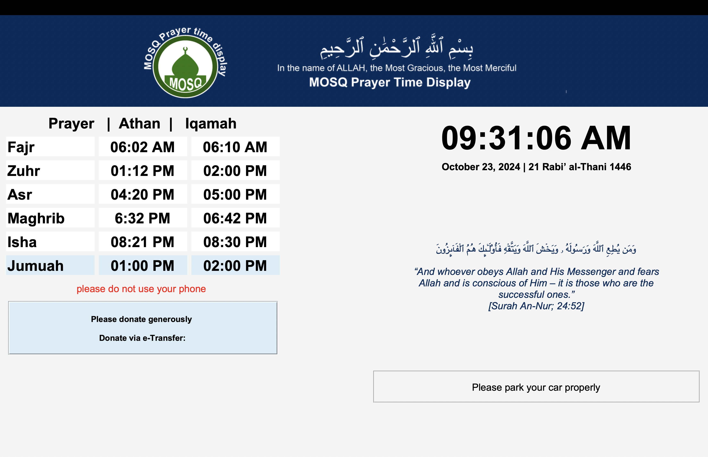

# Mosq

**Mosq** is a Python application designed for use on Raspberry Pi to display prayer times, announcements, Quran verses, and more in a mosque. The app features a full-screen mode and dynamically updates content such as the current time and announcements. The app was built using **Tkinter** for the UI, and it runs seamlessly on Raspberry Pi 3.

## Features

- Full-screen display of prayer times, mosque announcements, and Quran verses.
- Dynamically updates the current time in real-time.
- Static display for daily prayer times and other announcements.
- Easy-to-modify announcements and updates via mobile connection (to be added in future updates).
- Simple and user-friendly interface suitable for mosque environments.
- Pressing the **Escape** key exits full-screen mode.

## Prerequisites

- **Raspberry Pi 3** (or higher)
- **Python 3.x** installed
- The following Python libraries:
  - `Tkinter`
  - `time` (standard Python library)
  
## Files 
- **app.py** is the API 
- **admin.html** that is the admin panel to allow admin to make changes on the mosq_display. password is hard coded (pass1)
- **final_logo3.png** this is the header of the display 
- **mosq_display.py** this is the display file

**View of mosq_display.py**
   
